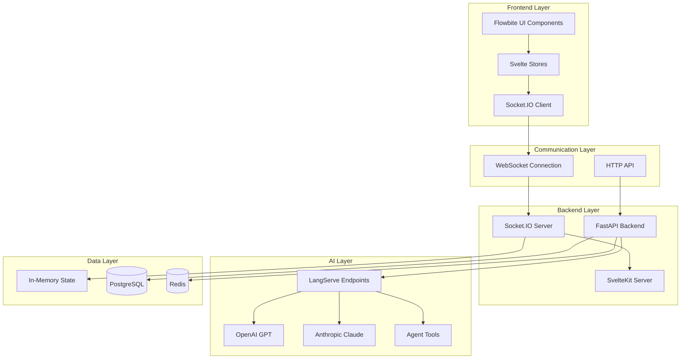
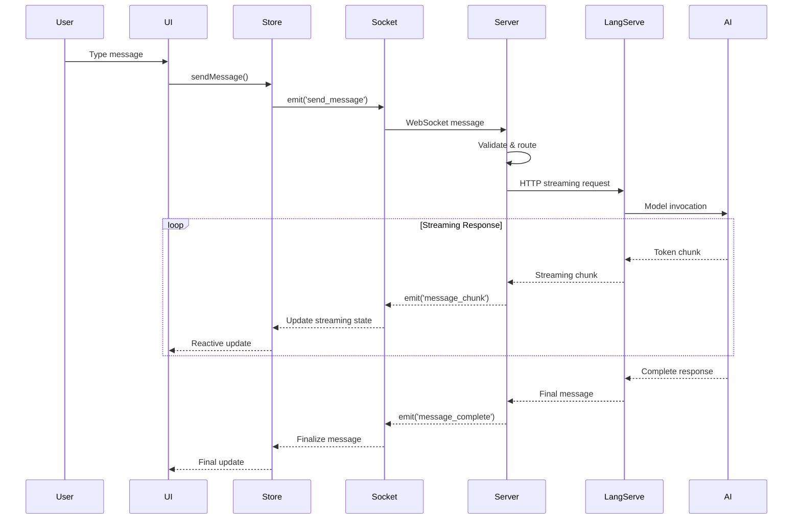
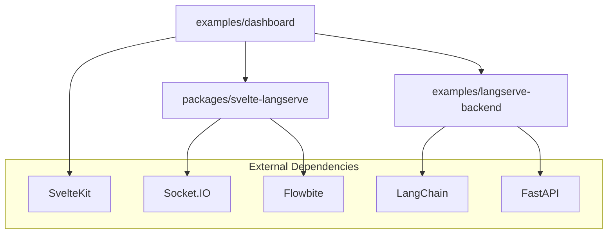

# Architecture Deep Dive

Complete technical overview of Svelte LangServe architecture, design patterns, and implementation details for developers who want to understand or extend the system.

## 🏗️ System Overview

Svelte LangServe implements a modern, real-time AI chat architecture with the following core components:



## 🔄 Data Flow Architecture

### Message Processing Pipeline



## 🏢 Monorepo Structure

### Package Organization

```
svelte-langserve/
├── packages/                    # Reusable packages
│   └── svelte-langserve/       # Consolidated library
│       ├── src/lib/
│       │   ├── components/     # Svelte UI components
│       │   ├── stores/         # State management
│       │   ├── client/         # Socket.IO client logic
│       │   ├── themes/         # Flowbite theme system
│       │   └── types.ts        # TypeScript definitions
│       └── package.json
├── examples/                   # Reference implementations
│   ├── dashboard/             # SvelteKit frontend example
│   │   ├── src/
│   │   │   ├── lib/
│   │   │   │   └── langserve/  # Local implementation (to be deprecated)
│   │   │   ├── routes/         # SvelteKit routes
│   │   │   └── hooks.server.ts # Socket.IO server integration
│   │   └── package.json
│   └── langserve-backend/     # FastAPI backend example
│       ├── src/svelte_langserve/
│       │   ├── chains/         # AI agent implementations
│       │   ├── auth.py         # Authentication
│       │   └── main.py         # FastAPI app
│       └── pyproject.toml
└── docs/                      # Documentation
```

### Package Dependencies



## 🎨 Frontend Architecture

### Component Hierarchy

```
LangServeFrontend (Root)
├── ThemeProvider (Context)
│   ├── ConversationList (Sidebar)
│   │   ├── ConversationItem
│   │   └── CreateButton
│   ├── ChatInterface (Main)
│   │   ├── MessageList
│   │   │   └── ChatMessage × N
│   │   └── MessageInput
│   ├── EndpointSelector (Config)
│   └── ConfigPanel (Settings)
└── ErrorBoundary (Wrapper)
```

### State Management Pattern

```typescript
// Reactive state architecture using Svelte 5 runes
interface LangServeState {
  // Connection state
  socket: Socket | null;
  connected: boolean;
  authenticated: boolean;
  
  // Data state
  conversations: Conversation[];
  activeConversationId: string | null;
  
  // Streaming state
  streamingMessages: Map<string, string>;
  
  // UI state
  endpointHealth: Map<string, boolean>;
  messagePagination: Map<string, PaginationState>;
}

// Store implementation with automatic cleanup
const createLangServeStore = () => {
  const { subscribe, update } = writable<LangServeState>(initialState);
  
  // Automatic memory management
  const cleanupInterval = setInterval(() => {
    update(state => ({
      ...state,
      streamingMessages: cleanupOldStreams(state.streamingMessages)
    }));
  }, 60000);
  
  return {
    subscribe,
    
    // Actions that update state and trigger side effects
    connect: async (url: string, userId: string, token?: string) => {
      // Connection logic with error handling
    },
    
    sendMessage: (conversationId: string, content: string, endpoints: string[]) => {
      // Message sending with optimistic updates
    },
    
    // Cleanup function
    destroy: () => {
      clearInterval(cleanupInterval);
    }
  };
};
```

### Theme System Architecture

```typescript
// Theme provider pattern with context inheritance
interface ThemeContext {
  theme: ChatTheme;
  config: ThemeConfig;
  variant?: ThemeVariant;
  override?: ThemeOverride;
}

// Component theme integration
export function useTheme(): ChatTheme {
  const context = getContext<ThemeContext>('theme');
  return context?.theme || defaultTheme;
}

// Runtime theme computation
function createSafeTheme(
  baseTheme: ChatTheme,
  variant?: ThemeVariant,
  override?: ThemeOverride
): ChatTheme {
  let computedTheme = { ...baseTheme };
  
  // Apply variant modifications
  if (variant) {
    computedTheme = applyVariant(computedTheme, variant);
  }
  
  // Apply runtime overrides
  if (override) {
    computedTheme = { ...computedTheme, ...override };
  }
  
  // Validate theme completeness
  return validateAndFillTheme(computedTheme);
}
```

## 🔧 Backend Architecture

### FastAPI Application Structure

```python
# Layered architecture pattern
from fastapi import FastAPI
from fastapi.middleware.cors import CORSMiddleware
from langserve import add_routes

def create_app() -> FastAPI:
    app = FastAPI(
        title="Svelte LangServe Backend",
        description="AI chat backend with LangServe integration",
        version="1.0.0"
    )
    
    # Middleware stack
    setup_middleware(app)
    
    # Authentication
    setup_auth(app)
    
    # LangServe routes
    setup_langserve_routes(app)
    
    # API routes
    setup_api_routes(app)
    
    # Error handlers
    setup_error_handlers(app)
    
    return app

# LangServe integration pattern
def setup_langserve_routes(app: FastAPI):
    """Setup LangServe endpoints for AI agents."""
    
    # Each agent is a separate chain
    agents = {
        "chatbot": create_chatbot_chain(),
        "code-assistant": create_code_assistant_chain(),
        "data-analyst": create_data_analyst_chain(),
        "creative-writer": create_creative_writer_chain(),
        "research-assistant": create_research_assistant_chain()
    }
    
    for agent_id, chain in agents.items():
        add_routes(
            app,
            chain,
            path=f"/{agent_id}",
            enable_feedback_endpoint=True,
            enable_public_trace_link_endpoint=True,
            playground_type="default"
        )
```

### Agent Chain Architecture

```python
# Base agent pattern
from abc import ABC, abstractmethod
from langchain_core.runnables import Runnable
from langchain_core.prompts import ChatPromptTemplate

class BaseAgent(ABC):
    """Base class for all AI agents."""
    
    def __init__(self, llm_provider: str = "openai"):
        self.llm = get_llm(llm_provider)
        self.prompt = self.create_prompt()
        self.tools = self.get_tools()
    
    @abstractmethod
    def create_prompt(self) -> ChatPromptTemplate:
        """Create the agent's prompt template."""
        pass
    
    def get_tools(self) -> list:
        """Get tools available to this agent."""
        return []
    
    def create_chain(self) -> Runnable:
        """Create the agent's execution chain."""
        if self.tools:
            # Tool-using agent
            return self.prompt | self.llm.bind_tools(self.tools)
        else:
            # Simple chat agent
            return self.prompt | self.llm

# Specialized agent implementation
class CodeAssistantAgent(BaseAgent):
    def create_prompt(self) -> ChatPromptTemplate:
        return ChatPromptTemplate.from_messages([
            ("system", """You are a specialized coding assistant.
            
            Capabilities:
            - Write, debug, and explain code
            - Provide best practices and optimization tips
            - Support multiple programming languages
            - Offer architectural guidance
            
            Always:
            1. Provide working, tested code examples
            2. Explain your reasoning
            3. Suggest improvements and alternatives
            4. Follow security best practices
            """),
            ("human", "{input}")
        ])
    
    def get_tools(self) -> list:
        return [
            code_executor_tool,
            documentation_search_tool,
            syntax_checker_tool
        ]
```

### Memory Management

```python
# Conversation memory management
from langchain.memory import ConversationBufferWindowMemory
from langchain_core.chat_history import BaseChatMessageHistory

class ConversationManager:
    """Manages conversation state and memory."""
    
    def __init__(self):
        self.conversations: dict[str, ConversationState] = {}
        self.memory_instances: dict[str, ConversationBufferWindowMemory] = {}
    
    def get_or_create_conversation(
        self, 
        conversation_id: str,
        participants: list[str]
    ) -> ConversationState:
        """Get existing conversation or create new one."""
        
        if conversation_id not in self.conversations:
            # Create conversation state
            self.conversations[conversation_id] = ConversationState(
                id=conversation_id,
                participants=participants,
                created_at=datetime.utcnow(),
                messages=[]
            )
            
            # Create memory instance
            self.memory_instances[conversation_id] = ConversationBufferWindowMemory(
                k=20,  # Keep last 20 messages
                return_messages=True,
                memory_key="chat_history"
            )
        
        return self.conversations[conversation_id]
    
    def add_message(self, conversation_id: str, message: ChatMessage):
        """Add message to conversation and update memory."""
        conversation = self.get_or_create_conversation(conversation_id, [])
        conversation.messages.append(message)
        conversation.updated_at = datetime.utcnow()
        
        # Update LangChain memory
        memory = self.memory_instances[conversation_id]
        if message.type == "human":
            memory.chat_memory.add_user_message(message.content)
        elif message.type == "ai":
            memory.chat_memory.add_ai_message(message.content)
    
    def get_memory(self, conversation_id: str) -> ConversationBufferWindowMemory:
        """Get memory instance for conversation."""
        if conversation_id not in self.memory_instances:
            self.get_or_create_conversation(conversation_id, [])
        return self.memory_instances[conversation_id]
```

## 🔌 Socket.IO Integration

### Server-Side Architecture

```typescript
// Socket.IO server integration with SvelteKit
import type { Handle } from '@sveltejs/kit';
import { Server } from 'socket.io';

interface SocketData {
  user: User;
  userId: string;
  activeConversations: Set<string>;
}

class SocketManager {
  private io: Server;
  private conversationManager: ConversationManager;
  private langserveClients: LangServeClientManager;
  
  constructor(
    httpServer: any,
    conversationManager: ConversationManager,
    langserveClients: LangServeClientManager
  ) {
    this.io = new Server(httpServer, {
      cors: {
        origin: process.env.CORS_ORIGINS?.split(',') || ["http://localhost:5173"],
        credentials: true
      },
      path: "/socket.io/"
    });
    
    this.conversationManager = conversationManager;
    this.langserveClients = langserveClients;
    
    this.setupMiddleware();
    this.setupEventHandlers();
  }
  
  private setupMiddleware() {
    // Authentication middleware
    this.io.use(async (socket, next) => {
      try {
        const token = socket.handshake.auth.token;
        const user = await validateJWTToken(token);
        
        socket.data.user = user;
        socket.data.userId = user.id;
        socket.data.activeConversations = new Set();
        
        next();
      } catch (error) {
        next(new Error('Authentication failed'));
      }
    });
    
    // Rate limiting middleware
    this.io.use(rateLimitMiddleware);
  }
  
  private setupEventHandlers() {
    this.io.on('connection', (socket) => {
      console.log(`User ${socket.data.userId} connected`);
      
      // Join user-specific room
      socket.join(`user:${socket.data.userId}`);
      
      // Message handling
      socket.on('send_message', (data) => this.handleSendMessage(socket, data));
      socket.on('join_conversation', (data) => this.handleJoinConversation(socket, data));
      socket.on('leave_conversation', (data) => this.handleLeaveConversation(socket, data));
      
      // Cleanup on disconnect
      socket.on('disconnect', () => this.handleDisconnect(socket));
    });
  }
  
  private async handleSendMessage(socket: SocketWithData, data: SendMessageData) {
    const { conversationId, content, endpoints, messageId, metadata } = data;
    
    try {
      // Validate access
      if (!socket.data.activeConversations.has(conversationId)) {
        socket.emit('error', { type: 'PERMISSION_DENIED', message: 'Not in conversation' });
        return;
      }
      
      // Add user message to conversation
      const userMessage = {
        id: messageId,
        type: 'human' as const,
        content,
        sender_id: socket.data.userId,
        timestamp: new Date().toISOString(),
        conversation_id: conversationId
      };
      
      this.conversationManager.addMessage(conversationId, userMessage);
      
      // Broadcast to conversation participants
      this.io.to(`conversation:${conversationId}`).emit('message_received', {
        messageId,
        conversationId,
        message: userMessage
      });
      
      // Process with AI agents
      await this.processWithAgents(conversationId, content, endpoints, metadata);
      
    } catch (error) {
      socket.emit('error', {
        type: 'MESSAGE_ERROR',
        message: error.message,
        messageId
      });
    }
  }
  
  private async processWithAgents(
    conversationId: string,
    content: string,
    endpoints: string[],
    metadata?: MessageMetadata
  ) {
    for (const endpointId of endpoints) {
      try {
        const client = this.langserveClients.getClient(endpointId);
        const memory = this.conversationManager.getMemory(conversationId);
        
        // Prepare input with conversation history
        const input = {
          input: content,
          chat_history: memory.chat_memory.messages
        };
        
        // Stream response
        const stream = await client.stream(input, {
          metadata: {
            conversation_id: conversationId,
            endpoint_id: endpointId,
            ...metadata
          }
        });
        
        let fullResponse = '';
        const aiMessageId = `ai_${Date.now()}_${endpointId}`;
        
        for await (const chunk of stream) {
          const content = extractContentFromChunk(chunk);
          if (content) {
            fullResponse += content;
            
            // Emit streaming chunk
            this.io.to(`conversation:${conversationId}`).emit('message_chunk', {
              messageId: aiMessageId,
              conversationId,
              content,
              agentId: endpointId,
              isComplete: false
            });
          }
        }
        
        // Emit completion
        const aiMessage = {
          id: aiMessageId,
          type: 'ai' as const,
          content: fullResponse,
          sender_id: endpointId,
          timestamp: new Date().toISOString(),
          conversation_id: conversationId
        };
        
        this.conversationManager.addMessage(conversationId, aiMessage);
        
        this.io.to(`conversation:${conversationId}`).emit('message_complete', {
          messageId: aiMessageId,
          conversationId,
          message: aiMessage
        });
        
      } catch (error) {
        this.io.to(`conversation:${conversationId}`).emit('message_error', {
          type: 'AI_ERROR',
          message: error.message,
          agentId: endpointId,
          conversationId
        });
      }
    }
  }
}
```

### Client-Side Socket Integration

```typescript
// Reactive Socket.IO client with automatic reconnection
class LangServeSocketClient {
  private socket: Socket | null = null;
  private reconnectAttempts = 0;
  private maxReconnectAttempts = 5;
  private reconnectDelay = 1000;
  
  constructor(private store: LangServeStore) {}
  
  connect(url: string, token: string): Promise<void> {
    return new Promise((resolve, reject) => {
      this.socket = io(url, {
        auth: { token },
        autoConnect: false,
        transports: ['websocket', 'polling']
      });
      
      // Connection events
      this.socket.on('connect', () => {
        this.reconnectAttempts = 0;
        this.store.setConnected(true);
        resolve();
      });
      
      this.socket.on('connect_error', (error) => {
        this.handleConnectionError(error);
        reject(error);
      });
      
      this.socket.on('disconnect', (reason) => {
        this.store.setConnected(false);
        if (reason === 'io server disconnect') {
          // Server disconnected us, don't reconnect automatically
          return;
        }
        this.attemptReconnect();
      });
      
      // Message events
      this.socket.on('message_chunk', (chunk) => {
        this.store.updateStreamingMessage(chunk.messageId, chunk.content);
      });
      
      this.socket.on('message_complete', (data) => {
        this.store.addMessage(data.conversationId, data.message);
        this.store.clearStreamingMessage(data.messageId);
      });
      
      this.socket.on('error', (error) => {
        this.store.setError(error.message);
      });
      
      this.socket.connect();
    });
  }
  
  private attemptReconnect() {
    if (this.reconnectAttempts >= this.maxReconnectAttempts) {
      this.store.setError('Maximum reconnection attempts reached');
      return;
    }
    
    this.reconnectAttempts++;
    const delay = this.reconnectDelay * Math.pow(2, this.reconnectAttempts - 1);
    
    setTimeout(() => {
      this.socket?.connect();
    }, delay);
  }
  
  sendMessage(conversationId: string, content: string, endpoints: string[]) {
    if (!this.socket?.connected) {
      throw new Error('Socket not connected');
    }
    
    const messageId = `msg_${Date.now()}`;
    
    this.socket.emit('send_message', {
      conversationId,
      content,
      endpoints,
      messageId,
      metadata: {
        timestamp: Date.now(),
        streaming: true
      }
    });
    
    return messageId;
  }
}
```

## 🔄 Performance Optimizations

### Frontend Optimizations

```typescript
// Virtual scrolling for large message lists
import { VirtualList } from '@sveltejs/virtual-list';

// Message virtualization
export function createMessageVirtualizer(messages: ChatMessage[]) {
  const ITEM_HEIGHT = 80; // Average message height
  const BUFFER_SIZE = 5;   // Extra items to render
  
  return {
    itemHeight: ITEM_HEIGHT,
    bufferSize: BUFFER_SIZE,
    items: messages,
    
    // Efficient scrolling to bottom
    scrollToBottom: (container: HTMLElement) => {
      requestAnimationFrame(() => {
        container.scrollTop = container.scrollHeight;
      });
    }
  };
}

// Debounced input handling
export function createDebouncedInput(callback: Function, delay: number = 300) {
  let timeoutId: NodeJS.Timeout;
  
  return (...args: any[]) => {
    clearTimeout(timeoutId);
    timeoutId = setTimeout(() => callback(...args), delay);
  };
}

// Memory-efficient streaming updates
export function createStreamingMessageStore() {
  const streamingMessages = new Map<string, string>();
  const MAX_STREAMING_MESSAGES = 10;
  const CLEANUP_INTERVAL = 30000; // 30 seconds
  
  // Automatic cleanup of old streaming messages
  setInterval(() => {
    if (streamingMessages.size > MAX_STREAMING_MESSAGES) {
      const entries = Array.from(streamingMessages.entries());
      const toRemove = entries.slice(0, entries.length - MAX_STREAMING_MESSAGES);
      toRemove.forEach(([key]) => streamingMessages.delete(key));
    }
  }, CLEANUP_INTERVAL);
  
  return {
    add: (id: string, content: string) => streamingMessages.set(id, content),
    update: (id: string, content: string) => {
      const existing = streamingMessages.get(id) || '';
      streamingMessages.set(id, existing + content);
    },
    get: (id: string) => streamingMessages.get(id),
    delete: (id: string) => streamingMessages.delete(id),
    clear: () => streamingMessages.clear()
  };
}
```

### Backend Optimizations

```python
# Connection pooling and async optimization
import asyncio
import asyncpg
from contextlib import asynccontextmanager

class DatabaseManager:
    def __init__(self, database_url: str):
        self.database_url = database_url
        self.pool: asyncpg.Pool = None
    
    async def create_pool(self):
        self.pool = await asyncpg.create_pool(
            self.database_url,
            min_size=5,
            max_size=20,
            command_timeout=60,
            server_settings={
                'jit': 'off',  # Disable JIT for faster startup
                'application_name': 'svelte-langserve'
            }
        )
    
    @asynccontextmanager
    async def get_connection(self):
        async with self.pool.acquire() as connection:
            yield connection

# Efficient message batching
class MessageProcessor:
    def __init__(self, batch_size: int = 10, flush_interval: float = 1.0):
        self.batch_size = batch_size
        self.flush_interval = flush_interval
        self.message_queue: list[ChatMessage] = []
        self.last_flush = time.time()
    
    async def add_message(self, message: ChatMessage):
        self.message_queue.append(message)
        
        # Flush if batch is full or time elapsed
        if (len(self.message_queue) >= self.batch_size or 
            time.time() - self.last_flush >= self.flush_interval):
            await self.flush_messages()
    
    async def flush_messages(self):
        if not self.message_queue:
            return
        
        try:
            await self.batch_insert_messages(self.message_queue)
            self.message_queue.clear()
            self.last_flush = time.time()
        except Exception as e:
            logger.error(f"Failed to flush messages: {e}")

# LangServe client pooling
class LangServeClientPool:
    def __init__(self, endpoint_url: str, pool_size: int = 5):
        self.endpoint_url = endpoint_url
        self.pool_size = pool_size
        self.clients: list[RemoteRunnable] = []
        self.available_clients = asyncio.Queue()
        
    async def initialize(self):
        for _ in range(self.pool_size):
            client = RemoteRunnable(url=self.endpoint_url)
            self.clients.append(client)
            await self.available_clients.put(client)
    
    @asynccontextmanager
    async def get_client(self):
        client = await self.available_clients.get()
        try:
            yield client
        finally:
            await self.available_clients.put(client)
```

## 🧪 Testing Architecture

### Component Testing Strategy

```typescript
// Component testing with theme context
import { render, screen } from '@testing-library/svelte';
import { ThemeProvider, defaultTheme } from 'svelte-langserve';
import ChatMessage from '$lib/components/ChatMessage.svelte';

describe('ChatMessage Component', () => {
  const defaultProps = {
    message: {
      id: '1',
      content: 'Hello world',
      type: 'user' as const,
      timestamp: Date.now()
    }
  };
  
  function renderWithTheme(props = {}) {
    return render(ThemeProvider, {
      theme: defaultTheme,
      children: () => render(ChatMessage, { ...defaultProps, ...props })
    });
  }
  
  test('renders user message correctly', () => {
    renderWithTheme();
    expect(screen.getByText('Hello world')).toBeInTheDocument();
  });
  
  test('applies correct theme classes', () => {
    renderWithTheme();
    const messageElement = screen.getByTestId('chat-message');
    expect(messageElement).toHaveClass(defaultTheme.messageUser);
  });
});
```

### Integration Testing

```typescript
// Socket.IO integration testing
import { createTestServer } from '../test-utils/server';
import { io as Client } from 'socket.io-client';

describe('Socket.IO Integration', () => {
  let server: TestServer;
  let clientSocket: Socket;
  
  beforeEach(async () => {
    server = await createTestServer();
    clientSocket = Client(`http://localhost:${server.port}`, {
      auth: { token: 'test-jwt-token' }
    });
    
    await new Promise((resolve) => {
      clientSocket.on('connect', resolve);
    });
  });
  
  afterEach(async () => {
    clientSocket.close();
    await server.close();
  });
  
  test('message sending and receiving', async () => {
    const conversationId = 'test-conv-1';
    const messageContent = 'Test message';
    
    // Join conversation
    clientSocket.emit('join_conversation', {
      conversationId,
      userId: 'test-user',
      endpoints: ['chatbot']
    });
    
    await waitForEvent(clientSocket, 'conversation_joined');
    
    // Send message
    clientSocket.emit('send_message', {
      conversationId,
      content: messageContent,
      endpoints: ['chatbot'],
      messageId: 'test-msg-1'
    });
    
    // Verify message received
    const messageReceived = await waitForEvent(clientSocket, 'message_received');
    expect(messageReceived.message.content).toBe(messageContent);
    
    // Verify AI response
    const aiResponse = await waitForEvent(clientSocket, 'message_complete');
    expect(aiResponse.message.type).toBe('ai');
  });
});
```

This architecture documentation provides a comprehensive understanding of how Svelte LangServe is designed and implemented, enabling developers to effectively use, extend, and contribute to the system.