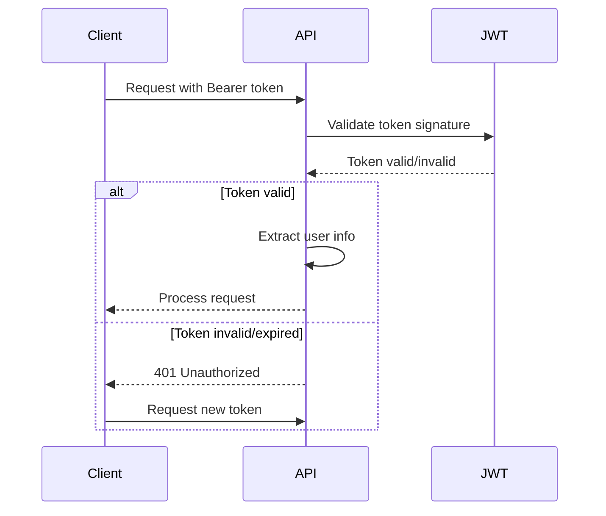
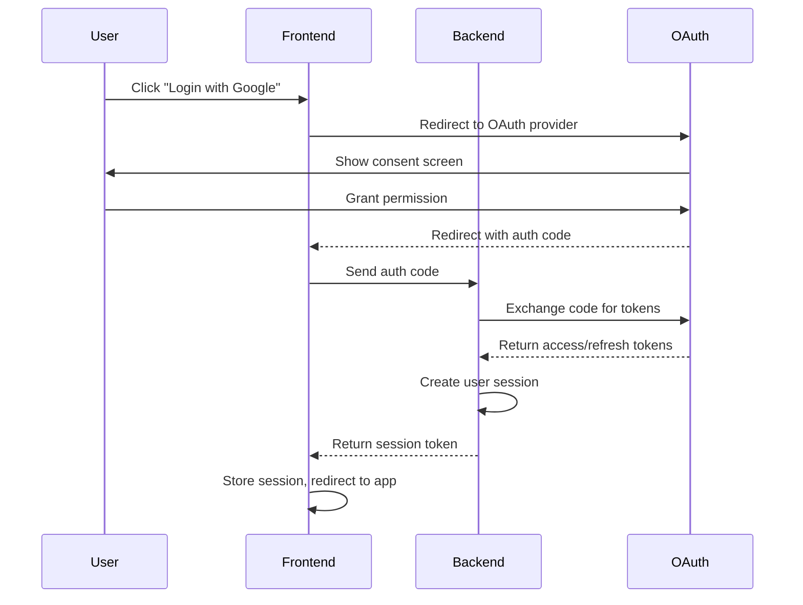

# Authentication Flow Guide

Complete guide to authentication workflows in the LangGraph application, including current demo implementation and future OAuth integration plans.

## 🚨 Current Implementation Status

> **⚠️ Demo Authentication Notice**  
> The current authentication system is a **proof of concept** for demonstration purposes only. It includes hardcoded demo users and simple JWT tokens. This will be completely replaced with OAuth 2.0/OIDC integration in production deployments.

## 🔐 Current Demo Authentication

### Available Demo Users

The system includes two hardcoded demo accounts:

```javascript
const demoUsers = {
  "demo": {
    username: "demo",
    password: "secret",
    full_name: "Demo User", 
    email: "demo@example.com",
    disabled: false
  },
  "admin": {
    username: "admin", 
    password: "secret",
    full_name: "Admin User",
    email: "admin@example.com", 
    disabled: false
  }
};
```

### JWT Token Configuration

**Token Settings:**
- **Algorithm**: HS256
- **Expiration**: 60 minutes (configurable)
- **Secret Key**: Configurable via environment variable
- **Token Type**: Bearer

**Security Note:** The demo uses a simple secret key. Production systems should use properly generated secrets and consider token rotation.

---

## 🔄 Authentication Workflows

### 1. REST API Authentication

#### Step 1: Obtain Access Token

```javascript
// POST /token
const response = await fetch('http://localhost:8000/token', {
  method: 'POST',
  headers: {
    'Content-Type': 'application/x-www-form-urlencoded'
  },
  body: 'username=demo&password=secret'
});

const { access_token, token_type } = await response.json();
```

#### Step 2: Use Token for API Requests

```javascript
// Include token in Authorization header
const apiResponse = await fetch('http://localhost:8000/assistants', {
  headers: {
    'Authorization': `Bearer ${access_token}`
  }
});
```

#### Step 3: Handle Token Expiration

```javascript
async function makeAuthenticatedRequest(url, options = {}) {
  let response = await fetch(url, {
    ...options,
    headers: {
      ...options.headers,
      'Authorization': `Bearer ${currentToken}`
    }
  });

  // If token expired, refresh and retry
  if (response.status === 401) {
    const newToken = await refreshToken();
    response = await fetch(url, {
      ...options,
      headers: {
        ...options.headers,
        'Authorization': `Bearer ${newToken}`
      }
    });
  }

  return response;
}
```

### 2. Socket.IO Authentication

#### Connection with JWT Token

```javascript
import { io } from 'socket.io-client';

// Option 1: Pass token during connection
const socket = io('http://localhost:3000', {
  auth: {
    token: access_token
  }
});

// Option 2: Authenticate after connection
socket.on('connect', () => {
  socket.emit('authenticate', {
    token: access_token
  });
});
```

#### Handle Authentication Events

```javascript
socket.on('authenticated', (data) => {
  console.log('Socket.IO authenticated:', data);
  // data contains: { userId, username, permissions, tokenExpiry }
});

socket.on('authentication_failed', (error) => {
  console.error('Socket.IO auth failed:', error);
  // Handle re-authentication or redirect to login
});
```

---

## 🛡️ Security Implementation

### Current Demo Security

**What's Implemented:**
- ✅ Password hashing (bcrypt)
- ✅ JWT token signing and validation
- ✅ Token expiration
- ✅ Protected route middleware
- ✅ CORS configuration

**What's Missing (Demo Limitations):**
- ❌ Proper user database
- ❌ Token refresh mechanism  
- ❌ Rate limiting on auth endpoints
- ❌ Account lockout protection
- ❌ Secure token storage
- ❌ HTTPS enforcement

### Token Validation Flow



---

## 🚀 Future OAuth Implementation

### Planned OAuth Providers

The production system will support these OAuth 2.0/OIDC providers:

- **Google** - Gmail/Workspace accounts
- **GitHub** - Developer-focused authentication  
- **Microsoft** - Azure AD/Office 365
- **Auth0** - Enterprise identity management
- **Custom OIDC** - Organization-specific providers

### OAuth Flow Architecture



### OAuth Configuration (Future)

```typescript
// Future OAuth configuration
interface OAuthConfig {
  google: {
    clientId: string;
    clientSecret: string;
    scopes: ['openid', 'profile', 'email'];
  };
  github: {
    clientId: string;
    clientSecret: string;
    scopes: ['user:email'];
  };
  microsoft: {
    clientId: string;
    clientSecret: string;
    tenantId: string;
    scopes: ['openid', 'profile', 'email'];
  };
}
```

---

## 🔧 Implementation Examples

### Frontend Authentication Hook

```typescript
// Future React/Svelte authentication hook
import { writable } from 'svelte/store';

interface AuthState {
  isAuthenticated: boolean;
  user: User | null;
  token: string | null;
  loading: boolean;
  error: string | null;
}

export const authStore = writable<AuthState>({
  isAuthenticated: false,
  user: null,
  token: null,
  loading: false,
  error: null
});

export const authService = {
  // Demo login (current)
  async loginDemo(username: string, password: string) {
    authStore.update(state => ({ ...state, loading: true }));
    
    try {
      const response = await fetch('/token', {
        method: 'POST',
        headers: { 'Content-Type': 'application/x-www-form-urlencoded' },
        body: `username=${username}&password=${password}`
      });
      
      if (!response.ok) throw new Error('Login failed');
      
      const { access_token } = await response.json();
      const user = await this.getCurrentUser(access_token);
      
      authStore.set({
        isAuthenticated: true,
        user,
        token: access_token,
        loading: false,
        error: null
      });
      
      return { success: true };
    } catch (error) {
      authStore.update(state => ({
        ...state,
        loading: false,
        error: error.message
      }));
      return { success: false, error: error.message };
    }
  },

  // Future OAuth login
  async loginOAuth(provider: 'google' | 'github' | 'microsoft') {
    // Will redirect to OAuth provider
    window.location.href = `/auth/${provider}`;
  },

  async getCurrentUser(token: string) {
    const response = await fetch('/users/me', {
      headers: { 'Authorization': `Bearer ${token}` }
    });
    return response.json();
  },

  logout() {
    authStore.set({
      isAuthenticated: false,
      user: null,
      token: null,
      loading: false,
      error: null
    });
  }
};
```

### Backend JWT Middleware

```python
# Current FastAPI JWT implementation
from fastapi import Depends, HTTPException, status
from fastapi.security import OAuth2PasswordBearer
from jose import JWTError, jwt

oauth2_scheme = OAuth2PasswordBearer(tokenUrl="token")

async def get_current_user(token: str = Depends(oauth2_scheme)):
    credentials_exception = HTTPException(
        status_code=status.HTTP_401_UNAUTHORIZED,
        detail="Could not validate credentials",
        headers={"WWW-Authenticate": "Bearer"},
    )
    
    try:
        payload = jwt.decode(token, SECRET_KEY, algorithms=[ALGORITHM])
        username = payload.get("sub")
        if username is None:
            raise credentials_exception
    except JWTError:
        raise credentials_exception
    
    user = get_user(fake_users_db, username=username)
    if user is None:
        raise credentials_exception
    return user
```

### Error Handling

```typescript
// Comprehensive auth error handling
class AuthError extends Error {
  constructor(
    message: string,
    public code: string,
    public statusCode: number = 401
  ) {
    super(message);
    this.name = 'AuthError';
  }
}

export const authErrorHandler = {
  handle(error: any) {
    if (error.status === 401) {
      return new AuthError(
        'Authentication required',
        'AUTH_REQUIRED',
        401
      );
    }
    
    if (error.status === 403) {
      return new AuthError(
        'Insufficient permissions',
        'INSUFFICIENT_PERMISSIONS', 
        403
      );
    }
    
    if (error.message?.includes('token')) {
      return new AuthError(
        'Invalid or expired token',
        'INVALID_TOKEN',
        401
      );
    }
    
    return new AuthError(
      'Authentication failed',
      'AUTH_FAILED',
      401
    );
  }
};
```

---

## 🧪 Testing Authentication

### Demo Authentication Testing

```bash
# Test demo login
curl -X POST "http://localhost:8000/token" \
  -H "Content-Type: application/x-www-form-urlencoded" \
  -d "username=demo&password=secret"

# Test protected endpoint
curl -X GET "http://localhost:8000/users/me" \
  -H "Authorization: Bearer <token>"

# Test invalid token
curl -X GET "http://localhost:8000/users/me" \
  -H "Authorization: Bearer invalid-token"
```

### Frontend Authentication Testing

```typescript
// Test authentication in frontend
describe('Authentication', () => {
  test('demo login success', async () => {
    const result = await authService.loginDemo('demo', 'secret');
    expect(result.success).toBe(true);
    
    const state = get(authStore);
    expect(state.isAuthenticated).toBe(true);
    expect(state.user).toBeTruthy();
  });

  test('demo login failure', async () => {
    const result = await authService.loginDemo('demo', 'wrong');
    expect(result.success).toBe(false);
    expect(result.error).toBeTruthy();
  });

  test('token expiration handling', async () => {
    // Mock expired token scenario
    const expiredToken = 'expired.jwt.token';
    
    const response = await fetch('/assistants', {
      headers: { 'Authorization': `Bearer ${expiredToken}` }
    });
    
    expect(response.status).toBe(401);
  });
});
```

---

## 📋 Migration Roadmap

### Phase 1: Current Demo (Completed)
- ✅ Basic JWT authentication
- ✅ Hardcoded demo users
- ✅ Protected API endpoints
- ✅ Socket.IO authentication

### Phase 2: OAuth Integration (Planned)
- 🔄 OAuth 2.0/OIDC provider setup
- 🔄 Frontend OAuth flow implementation
- 🔄 Backend OAuth token validation
- 🔄 User profile management

### Phase 3: Production Security (Future)
- ⏳ Token refresh mechanism
- ⏳ Rate limiting and abuse protection
- ⏳ Session management
- ⏳ Security monitoring

### Phase 4: Enterprise Features (Future)
- ⏳ Role-based access control (RBAC)
- ⏳ Multi-tenant support
- ⏳ SSO integration
- ⏳ Audit logging

---

## 🔒 Security Best Practices

### Current Demo Limitations

**⚠️ Do NOT use in production:**
- Hardcoded user database
- Simple secret key
- No rate limiting
- No account lockout
- HTTP-only (no HTTPS)

### Production Security Checklist

**Authentication Security:**
- [ ] Use OAuth 2.0/OIDC providers
- [ ] Implement proper token refresh
- [ ] Use secure token storage (httpOnly cookies)
- [ ] Enforce HTTPS everywhere
- [ ] Implement rate limiting
- [ ] Add account lockout protection
- [ ] Use secure session management

**API Security:**
- [ ] Validate all JWT tokens
- [ ] Implement proper CORS policies  
- [ ] Add request validation
- [ ] Use security headers
- [ ] Implement API rate limiting
- [ ] Add request logging and monitoring

---

For API endpoint authentication requirements, see the [REST API Reference](../reference/api/rest-endpoints.md).

For Socket.IO authentication events, see the [Socket.IO Events Reference](../reference/api/socket-events.md).