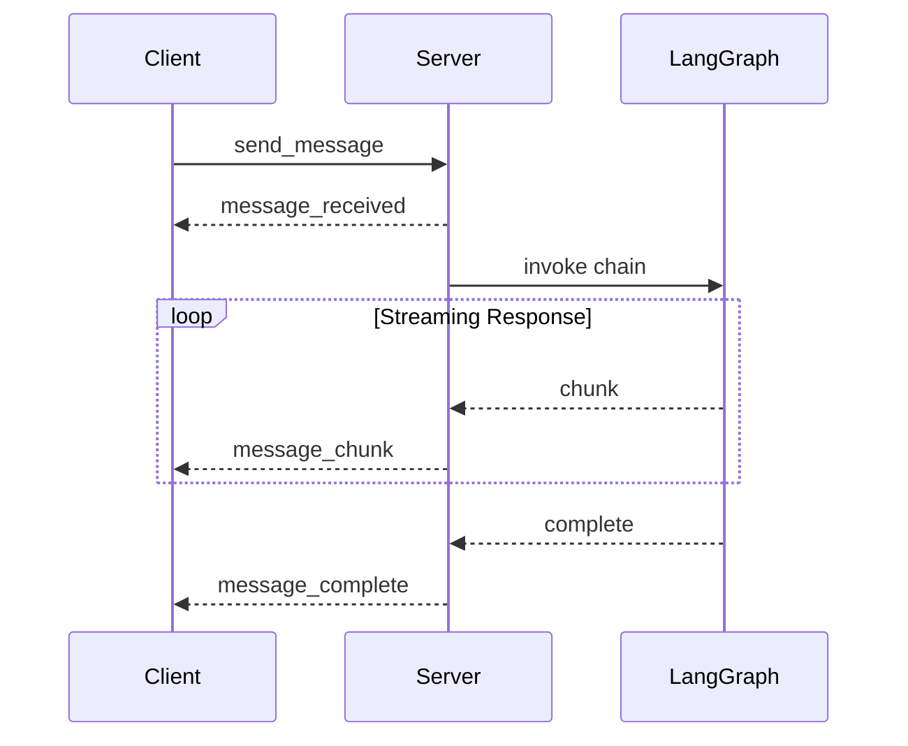
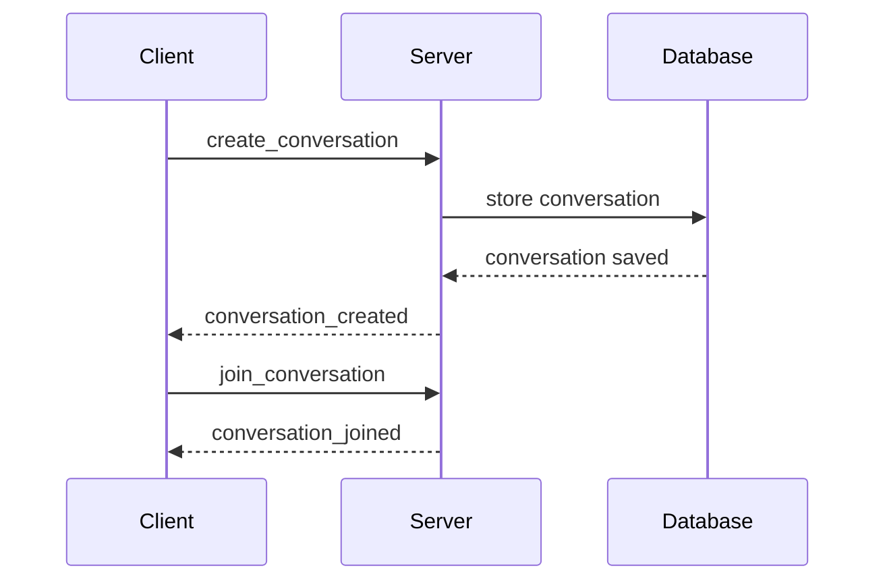

# Socket.IO Event Reference

Complete reference for all WebSocket events used in Svelte LangGraph for real-time AI chat communication.

## 📡 Connection Events

### Client → Server Events

#### `connect`
Establishes WebSocket connection to the server.

```typescript
// Automatically handled by Socket.IO client
socket.connect();
```

**Response**: Server acknowledges with `connect_ack` event.

#### `join_conversation`
Join or create a conversation room.

```typescript
socket.emit('join_conversation', {
  conversationId: string;
  userId: string;
  endpoints: string[];          // Array of agent IDs to include
  authToken?: string;           // JWT token for authentication
});
```

**Response**: `conversation_joined` event with conversation details.

**Example:**
```typescript
socket.emit('join_conversation', {
  conversationId: 'conv_123',
  userId: 'user_456',
  endpoints: ['chatbot', 'code-assistant'],
  authToken: 'eyJhbGciOiJIUzI1NiIs...'
});
```

#### `leave_conversation`
Leave a conversation room.

```typescript
socket.emit('leave_conversation', {
  conversationId: string;
  userId: string;
});
```

### Server → Client Events

#### `connect_ack`
Confirms successful connection to server.

```typescript
socket.on('connect_ack', (data: {
  socketId: string;
  timestamp: number;
  serverVersion: string;
}) => {
  console.log('Connected to server:', data.socketId);
});
```

#### `conversation_joined`
Confirms user joined conversation successfully.

```typescript
socket.on('conversation_joined', (data: {
  conversationId: string;
  participants: {
    users: string[];
    agents: LangGraphEndpoint[];
  };
  messageHistory: ChatMessage[];
  pagination: {
    currentPage: number;
    totalMessages: number;
    hasMore: boolean;
  };
}) => {
  // Handle successful join
});
```

#### `connection_error`
Reports connection or authentication errors.

```typescript
socket.on('connection_error', (error: {
  type: 'AUTH_FAILED' | 'CONVERSATION_NOT_FOUND' | 'SERVER_ERROR';
  message: string;
  code?: number;
}) => {
  console.error('Connection error:', error.message);
});
```

---

## 💬 Messaging Events

### Client → Server Events

#### `send_message`
Send a new message to AI agents in the conversation.

```typescript
socket.emit('send_message', {
  conversationId: string;
  content: string;
  endpoints: string[];          // Which agents should respond
  messageId: string;            // Unique message ID
  metadata?: {
    temperature?: number;       // AI creativity (0.0-1.0)
    maxTokens?: number;        // Response length limit
    streaming?: boolean;       // Enable streaming response
    model?: string;            // Specific model to use
  };
});
```

**Example:**
```typescript
socket.emit('send_message', {
  conversationId: 'conv_123',
  content: 'Explain quantum computing in simple terms',
  endpoints: ['chatbot'],
  messageId: 'msg_' + Date.now(),
  metadata: {
    temperature: 0.7,
    streaming: true,
    maxTokens: 500
  }
});
```

#### `regenerate_response`
Request a new response for the last message.

```typescript
socket.emit('regenerate_response', {
  conversationId: string;
  messageId: string;            // Message to regenerate response for
  endpoints: string[];          // Which agents should respond
  metadata?: MessageMetadata;
});
```

#### `stop_generation`
Stop ongoing AI response generation.

```typescript
socket.emit('stop_generation', {
  conversationId: string;
  messageId: string;
});
```

### Server → Client Events

#### `message_received`
Confirms server received the message.

```typescript
socket.on('message_received', (data: {
  messageId: string;
  conversationId: string;
  timestamp: number;
  status: 'received' | 'processing' | 'completed' | 'error';
}) => {
  // Update UI to show message status
});
```

#### `message_chunk`
Streaming response chunk from AI agent.

```typescript
socket.on('message_chunk', (chunk: {
  messageId: string;
  conversationId: string;
  content: string;              // Partial response content
  agentId: string;             // Which agent is responding
  isComplete: boolean;         // Whether this is the final chunk
  metadata?: {
    tokens: number;            // Tokens used so far
    model: string;             // Model being used
    responseTime: number;      // Generation time in ms
  };
}) => {
  // Append chunk to response display
});
```

#### `message_complete`
Indicates AI response is fully generated.

```typescript
socket.on('message_complete', (message: {
  id: string;
  conversationId: string;
  content: string;
  agentId: string;
  timestamp: number;
  metadata: {
    totalTokens: number;
    responseTime: number;
    model: string;
    cost?: number;
  };
}) => {
  // Finalize message display
});
```

#### `message_error`
Reports errors during message processing.

```typescript
socket.on('message_error', (error: {
  messageId: string;
  conversationId: string;
  type: 'RATE_LIMIT' | 'API_ERROR' | 'VALIDATION_ERROR' | 'TIMEOUT';
  message: string;
  retryable: boolean;
}) => {
  // Handle error and show user feedback
});
```

---

## 🔧 Configuration Events

### Client → Server Events

#### `update_conversation_config`
Update conversation settings.

```typescript
socket.emit('update_conversation_config', {
  conversationId: string;
  config: {
    temperature: number;
    streaming: boolean;
    maxTokens: number;
    model?: string;
    systemPrompt?: string;
  };
});
```

#### `get_endpoint_health`
Check health status of AI endpoints.

```typescript
socket.emit('get_endpoint_health', {
  endpoints?: string[];         // Check specific endpoints, or all if undefined
});
```

#### `test_assistant`
Test connectivity and basic functionality of a specific assistant.

```typescript
socket.emit('test_assistant', {
  assistantId: string;          // ID of assistant to test
  testMessage?: string;         // Optional test message (defaults to "Hello")
});
```

**Response**: `assistant_test_result` event with test results.

**Example:**
```typescript
socket.emit('test_assistant', {
  assistantId: 'chatbot',
  testMessage: 'Test connectivity'
});
```

#### `get_assistant_schemas`
Retrieve schema information for available assistants.

```typescript
socket.emit('get_assistant_schemas', {
  assistantIds?: string[];      // Specific assistants, or all if undefined
});
```

**Response**: `assistant_schemas` event with schema definitions.

### Server → Client Events

#### `config_updated`
Confirms configuration update.

```typescript
socket.on('config_updated', (data: {
  conversationId: string;
  config: ConversationConfig;
  timestamp: number;
}) => {
  // Update UI to reflect new config
});
```

#### `endpoint_health_status`
Reports health status of AI endpoints.

```typescript
socket.on('endpoint_health_status', (status: {
  [endpointId: string]: {
    healthy: boolean;
    responseTime: number;
    lastChecked: number;
    error?: string;
  };
}) => {
  // Update endpoint status indicators
});
```

#### `assistant_test_result`
Returns results from assistant connectivity test.

```typescript
socket.on('assistant_test_result', (result: {
  assistantId: string;
  success: boolean;
  responseTime: number;
  testMessage: string;
  response?: string;
  error?: string;
  timestamp: number;
}) => {
  // Handle test results
});
```

#### `assistant_schemas`
Provides schema information for assistants.

```typescript
socket.on('assistant_schemas', (schemas: {
  [assistantId: string]: {
    inputSchema: object;
    outputSchema: object;
    configSchema: object;
    metadata: {
      name: string;
      description: string;
      version: string;
    };
  };
}) => {
  // Use schema information for validation
});
```

#### `assistant_response_start`
Indicates an assistant has started processing a request.

```typescript
socket.on('assistant_response_start', (data: {
  messageId: string;
  conversationId: string;
  assistantId: string;
  timestamp: number;
  estimatedDuration?: number;
}) => {
  // Show loading state
});
```

#### `assistant_response_complete`
Indicates an assistant has finished processing a request.

```typescript
socket.on('assistant_response_complete', (data: {
  messageId: string;
  conversationId: string;
  assistantId: string;
  timestamp: number;
  duration: number;
  tokenCount?: number;
  cost?: number;
}) => {
  // Hide loading state, update metrics
});
```

#### `assistant_error`
Reports errors specific to assistant processing.

```typescript
socket.on('assistant_error', (error: {
  messageId: string;
  conversationId: string;
  assistantId: string;
  type: 'INVOCATION_ERROR' | 'TIMEOUT' | 'RATE_LIMIT' | 'API_ERROR';
  message: string;
  retryable: boolean;
  timestamp: number;
}) => {
  // Handle assistant-specific errors
});
```

---

## 📋 Conversation Management Events

### Client → Server Events

#### `create_conversation`
Create a new conversation.

```typescript
socket.emit('create_conversation', {
  title?: string;
  endpoints: string[];
  userId: string;
  metadata?: Record<string, unknown>;
});
```

#### `delete_conversation`
Delete an existing conversation.

```typescript
socket.emit('delete_conversation', {
  conversationId: string;
  userId: string;
});
```

#### `get_conversations`
Retrieve user's conversation list.

```typescript
socket.emit('get_conversations', {
  userId: string;
  limit?: number;
  offset?: number;
});
```

#### `get_message_history`
Load more messages for pagination.

```typescript
socket.emit('get_message_history', {
  conversationId: string;
  page: number;
  limit: number;
});
```

### Server → Client Events

#### `conversation_created`
Confirms new conversation creation.

```typescript
socket.on('conversation_created', (conversation: {
  id: string;
  title: string;
  createdAt: number;
  participants: {
    users: string[];
    agents: LangGraphEndpoint[];
  };
}) => {
  // Add to conversation list
});
```

#### `conversation_deleted`
Confirms conversation deletion.

```typescript
socket.on('conversation_deleted', (data: {
  conversationId: string;
  timestamp: number;
}) => {
  // Remove from conversation list
});
```

#### `conversations_list`
Returns user's conversations.

```typescript
socket.on('conversations_list', (data: {
  conversations: Conversation[];
  pagination: {
    total: number;
    page: number;
    limit: number;
    hasMore: boolean;
  };
}) => {
  // Update conversation list UI
});
```

#### `message_history`
Returns paginated message history.

```typescript
socket.on('message_history', (data: {
  conversationId: string;
  messages: ChatMessage[];
  pagination: {
    page: number;
    total: number;
    hasMore: boolean;
  };
}) => {
  // Prepend older messages to chat
});
```

---

## 🔒 Authentication Events

### Client → Server Events

#### `authenticate`
Authenticate with JWT token.

```typescript
socket.emit('authenticate', {
  token: string;
});
```

#### `refresh_token`
Refresh expired authentication token.

```typescript
socket.emit('refresh_token', {
  refreshToken: string;
});
```

### Server → Client Events

#### `authenticated`
Confirms successful authentication.

```typescript
socket.on('authenticated', (data: {
  userId: string;
  username: string;
  permissions: string[];
  tokenExpiry: number;
}) => {
  // Store user info and update UI
});
```

#### `authentication_failed`
Reports authentication failure.

```typescript
socket.on('authentication_failed', (error: {
  type: 'INVALID_TOKEN' | 'EXPIRED_TOKEN' | 'USER_NOT_FOUND';
  message: string;
  requiresLogin: boolean;
}) => {
  // Redirect to login or refresh token
});
```

#### `token_refreshed`
Provides new authentication token.

```typescript
socket.on('token_refreshed', (data: {
  token: string;
  expiry: number;
}) => {
  // Store new token
});
```

---

## 📊 Monitoring Events

### Server → Client Events

#### `system_status`
Periodic system health updates.

```typescript
socket.on('system_status', (status: {
  connectedUsers: number;
  activeConversations: number;
  apiHealth: {
    openai: boolean;
    anthropic: boolean;
    tavily: boolean;
  };
  serverLoad: number;
  timestamp: number;
}) => {
  // Update system status dashboard
});
```

#### `rate_limit_warning`
Warns about approaching rate limits.

```typescript
socket.on('rate_limit_warning', (warning: {
  endpoint: string;
  current: number;
  limit: number;
  resetTime: number;
}) => {
  // Show rate limit warning
});
```

---

## 🚨 Error Handling

### Common Error Types

```typescript
type ErrorType = 
  | 'AUTH_FAILED'           // Authentication error
  | 'RATE_LIMIT'           // API rate limit exceeded
  | 'API_ERROR'            // LangGraph API error
  | 'VALIDATION_ERROR'     // Invalid request data
  | 'TIMEOUT'              // Request timeout
  | 'CONVERSATION_NOT_FOUND' // Invalid conversation ID
  | 'PERMISSION_DENIED'    // Insufficient permissions
  | 'SERVER_ERROR';        // Internal server error

interface SocketError {
  type: ErrorType;
  message: string;
  code?: number;
  retryable: boolean;
  context?: Record<string, unknown>;
}
```

### Error Event

All errors are sent via the `error` event:

```typescript
socket.on('error', (error: SocketError) => {
  switch (error.type) {
    case 'AUTH_FAILED':
      // Redirect to login
      break;
    case 'RATE_LIMIT':
      // Show rate limit message
      break;
    case 'API_ERROR':
      if (error.retryable) {
        // Offer retry option
      }
      break;
    default:
      // Show generic error message
  }
});
```

---

## 🔄 Event Flow Examples

### Sending a Message



### Creating a Conversation



## 🛠 Implementation Example

Here's how to implement a complete Socket.IO client:

```typescript
import { io } from 'socket.io-client';

class LangGraphClient {
  private socket: Socket;
  
  constructor(serverUrl: string) {
    this.socket = io(serverUrl);
    this.setupEventHandlers();
  }
  
  private setupEventHandlers() {
    // Connection events
    this.socket.on('connect', () => {
      console.log('Connected to server');
    });
    
    this.socket.on('connect_ack', (data) => {
      console.log('Server acknowledged connection:', data);
    });
    
    // Message events
    this.socket.on('message_chunk', (chunk) => {
      this.handleStreamingChunk(chunk);
    });
    
    this.socket.on('message_complete', (message) => {
      this.handleCompleteMessage(message);
    });
    
    // Error handling
    this.socket.on('error', (error) => {
      this.handleError(error);
    });
  }
  
  // Public methods
  joinConversation(conversationId: string, userId: string, endpoints: string[]) {
    this.socket.emit('join_conversation', {
      conversationId,
      userId,
      endpoints
    });
  }
  
  sendMessage(conversationId: string, content: string, endpoints: string[]) {
    const messageId = 'msg_' + Date.now();
    this.socket.emit('send_message', {
      conversationId,
      content,
      endpoints,
      messageId,
      metadata: {
        streaming: true,
        temperature: 0.7
      }
    });
  }
  
  private handleStreamingChunk(chunk: MessageChunk) {
    // Update UI with streaming content
  }
  
  private handleCompleteMessage(message: ChatMessage) {
    // Finalize message display
  }
  
  private handleError(error: SocketError) {
    // Handle errors appropriately
  }
}
```

For complete implementation examples, see the [Tutorial](../getting-started/tutorial.md) and [Component Reference](./components.md).